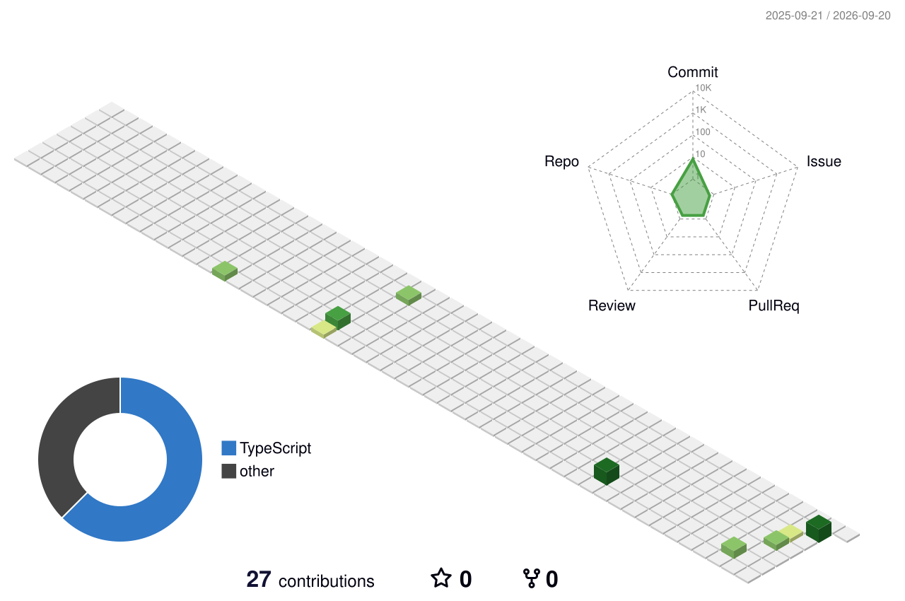

# Henry Santos

**Software Engineer · Product Builder · Founder @ HS Labs**

Building reliable software across backend, cloud, distributed systems, industrial integrations, and product development.

[LinkedIn](https://www.linkedin.com/in/henryquecido/) ·
[HS Labs](https://hslabs.com.br) ·
[Repositories](https://github.com/henrysantoss?tab=repositories)

---

## About

I'm a software engineer from Brazil who enjoys turning complex, ambiguous problems into reliable systems and useful products.

My work spans **backend services, cloud infrastructure, real-time data, web platforms, distributed systems, and industrial software**. Alongside my work at **iForth Sistemas**, I build independent software products through **HS Labs**.

I care about clear architecture, maintainable code, good developer experience, and software that solves real problems.

---

## Current focus

<table>
  <tr>
    <td width="50%" valign="top">
      <h3>Software Engineering</h3>
      

        Backend, cloud, web, real-time data and industrial systems at
        <strong>iForth Sistemas</strong>.
      

    </td>
    <td width="50%" valign="top">
      <h3>Product Building</h3>
      

        Focused software products, SaaS and practical experiments through
        <strong>HS Labs</strong>.
      

    </td>
  </tr>
</table>

---

## Selected stack

| Area | Technologies |
| --- | --- |
| **Backend** | Go · TypeScript / Node.js · Python · Java |
| **Frontend** | React · TypeScript |
| **Data & Messaging** | PostgreSQL · Redis · NATS · MQTT |
| **Infrastructure** | Docker · Linux · Nginx · GitHub Actions |
| **Observability** | OpenTelemetry · Prometheus |

I prefer showing the tools that reflect what I work with today rather than listing every technology I've used.

---

## Experience

| Role | Organization | Focus |
| --- | --- | --- |
| **Software Engineer** | **iForth Sistemas** | Backend, cloud, web, distributed and industrial software |
| **Founder** | **HS Labs** | Product development and SaaS |
| Software Developer | SEO Sistemas | Application development |
| Back-end Developer | Procer | Backend development |

**Education:** Computer Science · UNESC

---

## Beyond code

Outside software, I have a background in **competitive track athletics** and music as a **tuba player**. Both shaped how I think about consistency, practice, teamwork, and long-term improvement.

---

## GitHub

<picture>
  <source media="(prefers-color-scheme: dark)" srcset="./profile/stats-dark.svg">
  <source media="(prefers-color-scheme: light)" srcset="./profile/stats-light.svg">
  
</picture>

  

---

## Contributions

3D contribution history regenerated automatically every day.

---

**Build useful things. Keep them simple. Make them reliable.**

